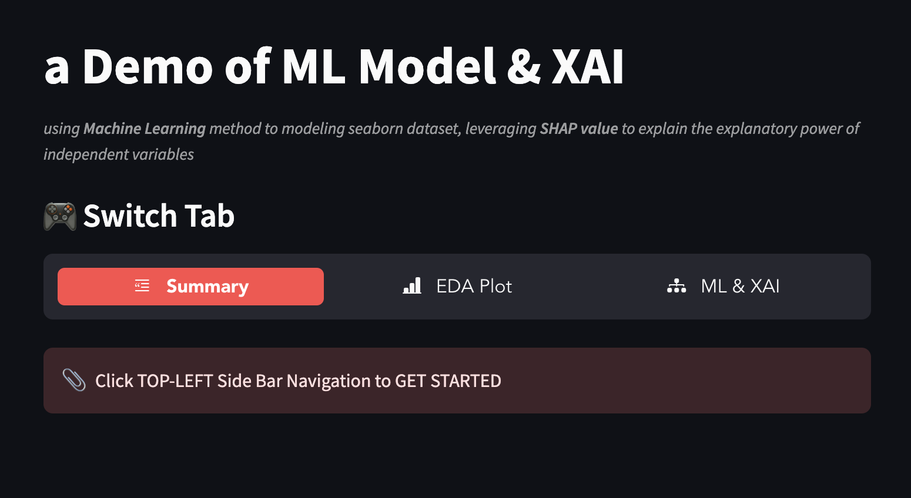
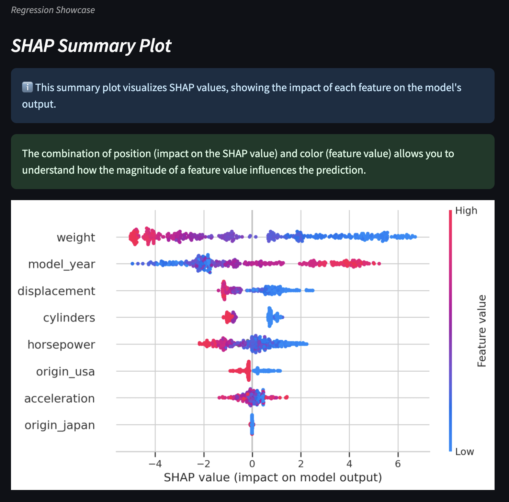
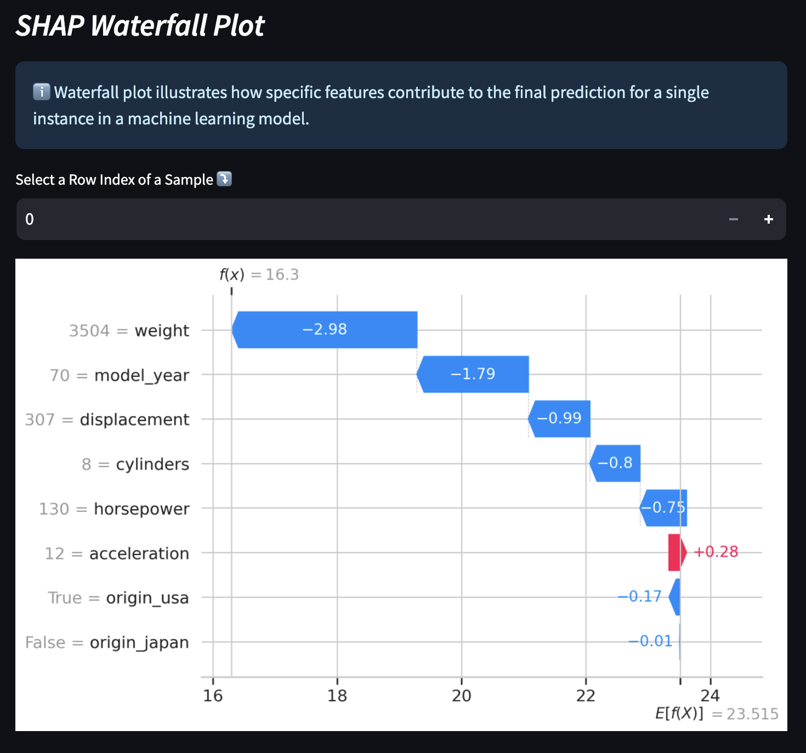

# 🕹️ Machine Learning & XAI Demo App

## 👁️‍🗨️ Overview

- This [Demo application](https://ml-xai-showcase-toolkit.streamlit.app/) demonstrates the integration of **Machine Learning** techniques and **Explainable AI (XAI)** methods using Streamlit.
- It utilizes Seaborn datasets (`mpg` and `titanic`) as examples for regression and classification tasks.
- Key functionalities include *dataset exploration*, *statistical analysis*, *model summary*, *feature importance visualization*, and *partial dependence plots*.

---

## 📎 Features

- **Dataset Selection**
  - Choose between preloaded datasets (`mpg` and `titanic`) or upload your custom dataset.
- **Dataset Summary**
  - View column descriptions, data types, and statistics.
- **Exploratory Data Analysis (EDA)**:
  - ANOVA(`one-way` & `three-way`)
  - Visualize data distributions
  - Multi-Collinearity diagnosis(`VIF`)
  - Correlation analysis(`Correlation Matrix` & `Pair plot`)
- **Machine Learning Models**
  - Regression case with `LGBMRegressor` on the `mpg` dataset.
  - Classification case with `RandomForestClassifier` on the `titanic` dataset.
- **Explainable AI**(XAI)
  - SHAP summary plots for feature importance.
  - Partial dependence plots for interaction effects.
  - SHAP waterfall plots for individual predictions.

---

## 📂 File Structure

```plaintext
ml-xai-demo/
├── app.py                  # Main Streamlit app file
├── assets/                 # Contains models, SHAP values, and other assets
├── requirements.txt        # Python dependencies
└── README.md               # Documentation
```

---

## ⚡ Dependencies

This application uses the following Python libraries:

- **Basic**: `streamlit`, `pickle`, `pandas`, `numpy`, `matplotlib`, `seaborn`
- **Machine Learning**: `scikit-learn`, `lightgbm`
- **Explainable AI**: `shap`, `pdpbox`
- **Statistics**: `statsmodels`, `scipy`

Install all dependencies via `requirements.txt`.

---

## 📷 Screenshots

### Home Page


### SHAP Summary Plot


### SHAP WaterFall Plot


---

## 📃 Contributing

Feel free to open issues or submit pull requests for improvements. Contributions are welcome!

---

## 🧰 License

This project is licensed under the MIT License. See the [LICENSE](LICENSE) file for details.

---

### 👾 Author
Developed with ❤️ by [Lean Lin]. 

For any queries or suggestions, please contact:
- [Gmail](mailto:xphoenixx32@gmail.com)
- [LinkedIn](https://www.linkedin.com/in/leanlin/)
